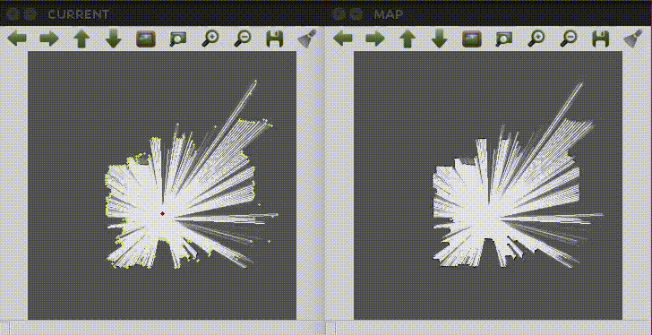
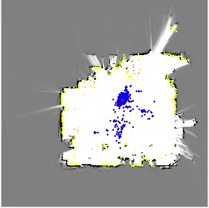

# Monte Carlo localization using 2D LiDAR on Robot Operating System (ROS)

---

## Explanation

### Easy-implemented Monte Carlo Localization (MCL) code on ros-kinetic

These codes are implemented only using OpenCV library! So It might be helpful for newbies to understand overall MCL procedures

Originally, it is RE510 materials implemented by Seungwon Song as a TA.

Original author: Seungwon Song (sswan55@kaist.ac.kr)  
Reviser : Hyungtae Lim (shapelim@kaist.ac.kr)  

---

## Results

### Mapgen

### MCL

---
## Usage
0. Setting
    1. Download this repository 
    <pre><code>git clone git@gitlab.com:ShapeLim/ros_mcl_cpp.git</code></pre>
    2. Build this ros code as follows.
    <pre><code>$ cd /home/$usr_name/catkin_ws</code></pre>
    <pre><code>$ catkin_make re510_slam</code></pre>

    Or if you use catkin-tools, then type below line on the command
    <pre><code>$ catkin build re510_slam</code></pre>

1. Mapgen

    1. Move to the repository e.g,
  
    <pre><code>$ cd /home/$usr_name/catkin_ws/src/ros_mcl_cpp</code></pre>

    2. Play rosbag **re510_mapgen.bag**

    <pre><code>$ rosbag play rosbag/rs_mapgen.bag</code></pre>

    3. Run mapgen code

    <pre><code>$ rosrun re510_slam rs_mapgen</code></pre>

2. MCL

    1. Move to the repository e.g,
  
    <pre><code>$ cd /home/$usr_name/catkin_ws/src/ros_mcl_cpp</code></pre>

    2. Play rosbag **re510_mcl.bag**

    <pre><code>$ rosbag play rosbag/rs_mcl.bag</code></pre>

    3. Run MCL code

    <pre><code>$ rosrun re510_slam rs_mcl</code></pre>

## Consideration

WBD
